# OpenTasks

A cross-platform task management app built with **Kotlin Multiplatform** and **Compose Multiplatform**, featuring Eisenhower Matrix prioritization to help you focus on what truly matters. Inspired by [TickTick](https://ticktick.com).

**Current release:** 1.2.0

Version 1.2.0 adds backend-free Local-only startup, authoritative PocketBase connection, bounded Quick Add, hardened import/share and process boundaries, bounded recurrence projection, and release-safe diagnostics and dependencies.

## Note
This project is built collaboratively with AI assistance (Claude Code). The code is reviewed, iterated on, and guided by me at every step — not auto-generated and dumped. Architecture decisions, feature design, and quality standards are human-driven; AI accelerates the implementation.

## Screenshots

<details>
<summary>View screenshots</summary>

<br>

**Core Screens**

<p>
  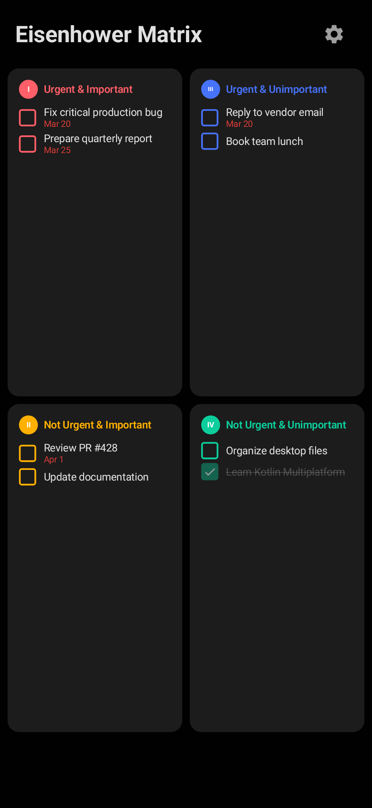
  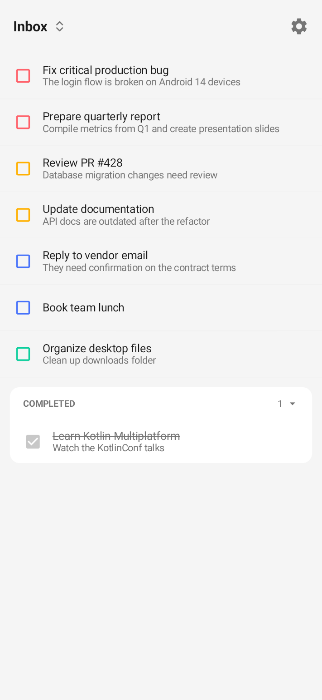
  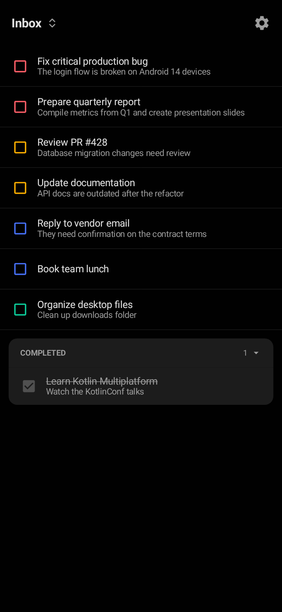
  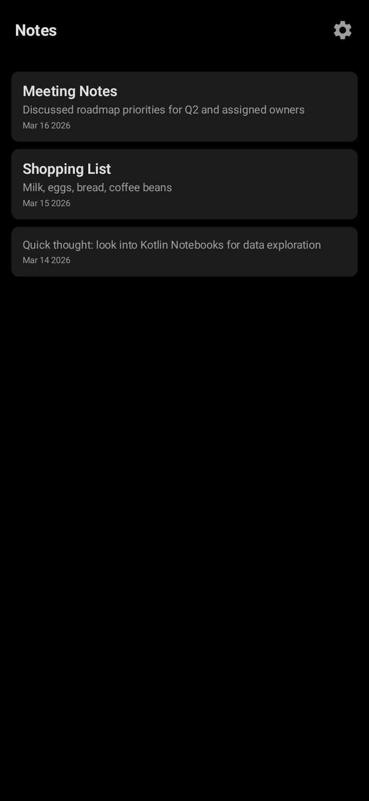
  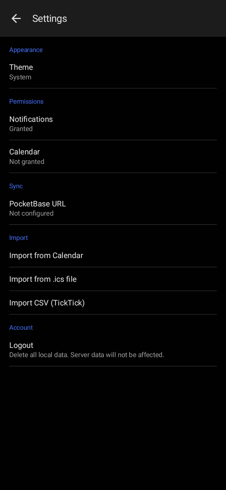
</p>

**Calendar Views**

<p>
  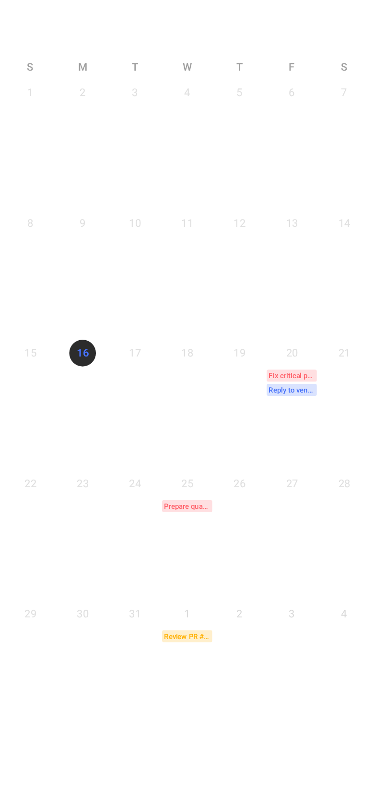
  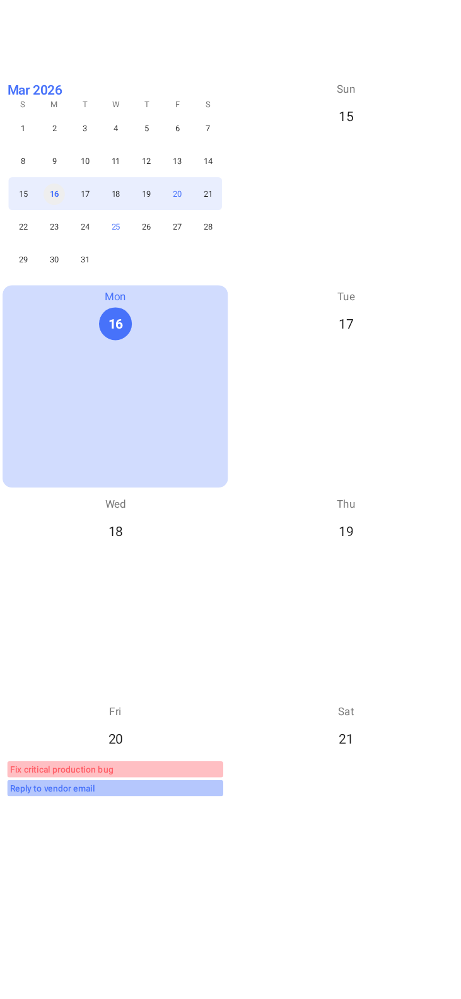
  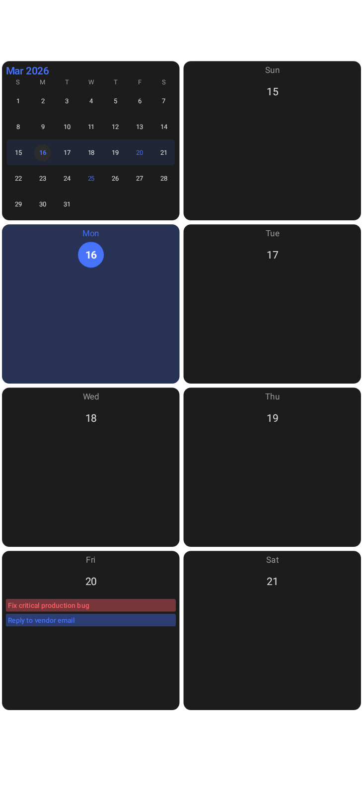
  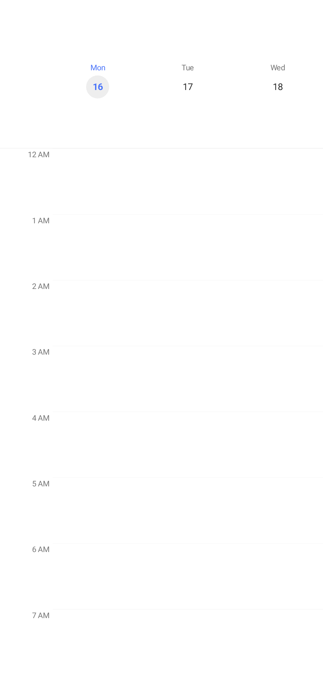
  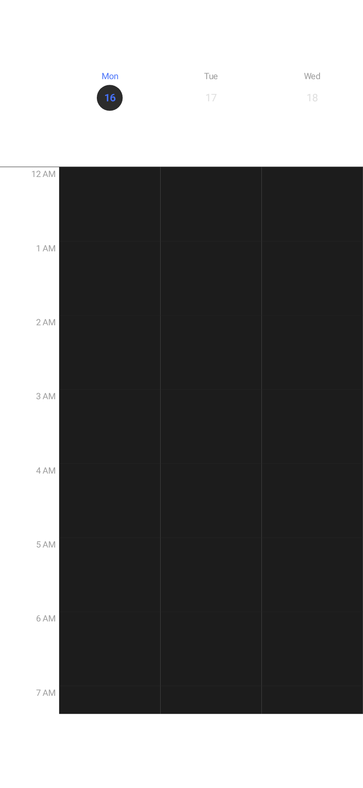
  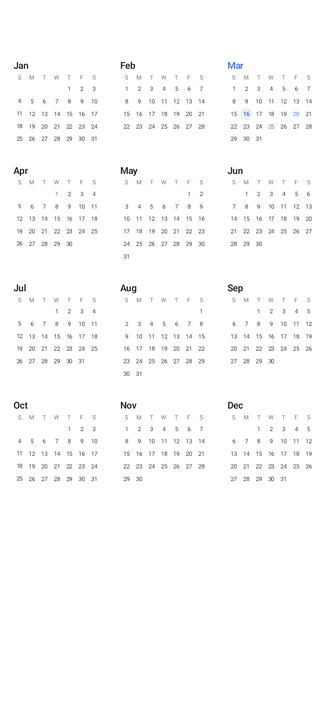
  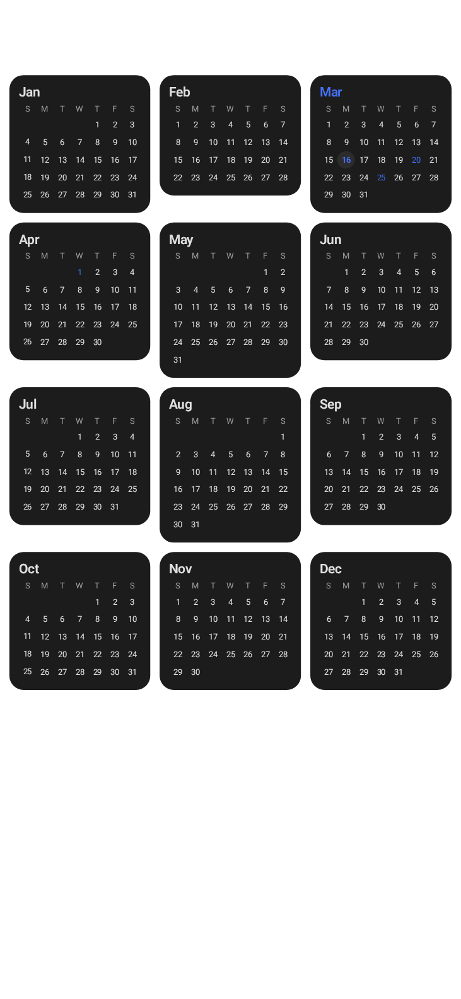
  
</p>

**Countdowns & Import**

<p>
  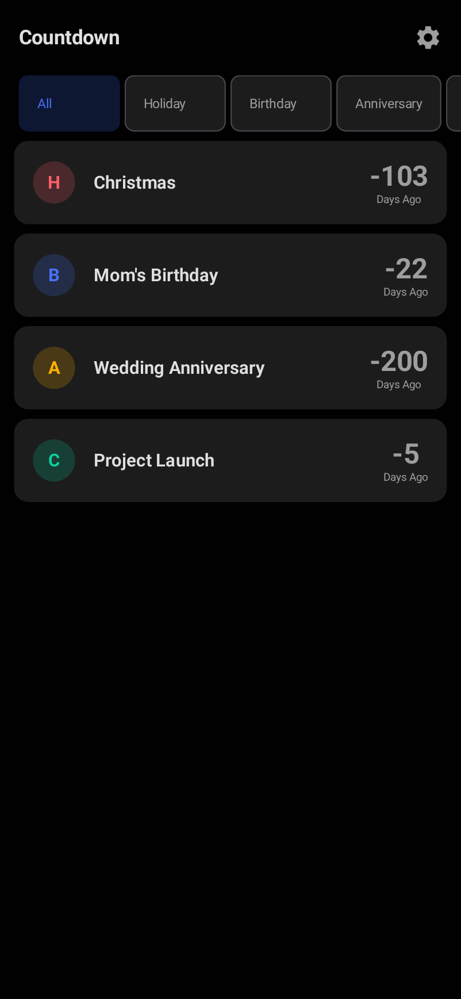
  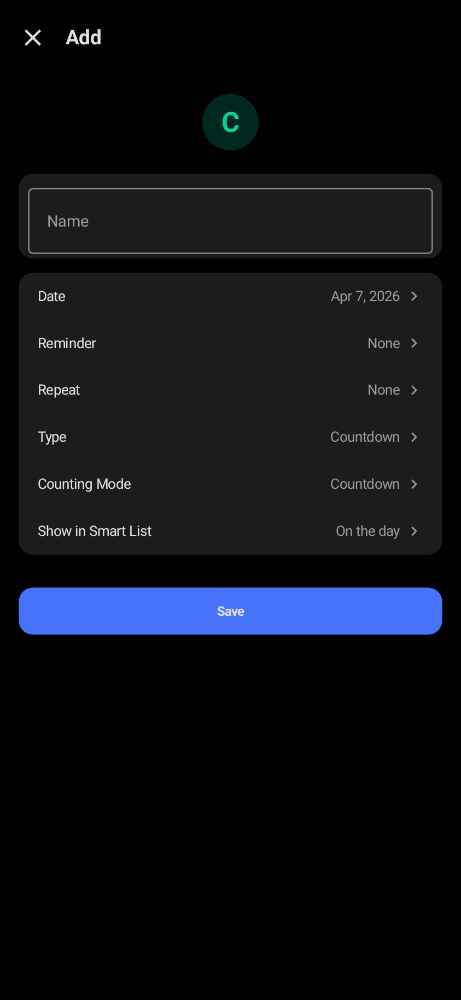
  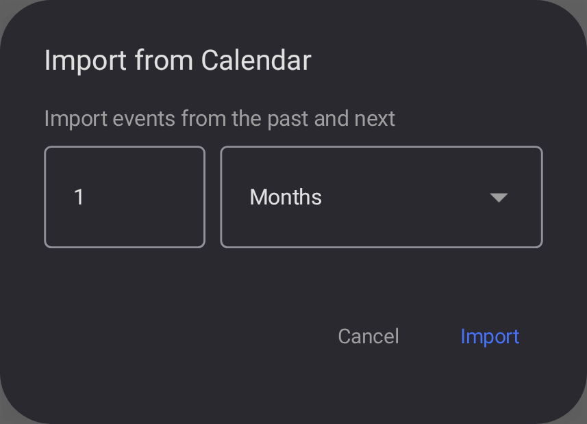
  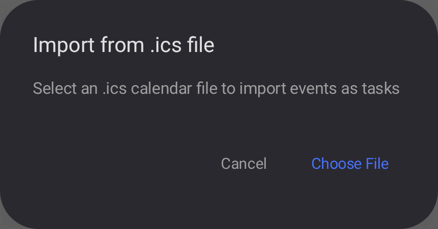
</p>

</details>

## Platforms

| Android | iOS | Desktop (JVM) |
|---------|-----|----------------|
| API 26+ (Android 8.0) | arm64 + Simulator | Linux, macOS, Windows |

## Documentation

See [docs/README.md](docs/README.md) for feature behavior and technical design notes.

## Features

### Task Management
- **Eisenhower Matrix** — Visualize tasks across four priority quadrants (Urgent & Important, Not Urgent & Important, Urgent & Unimportant, Not Urgent & Unimportant)
- **Task Lists** — Organize tasks into custom categories (default "Inbox" included)
- **Quick Add** — Capture a title with bounded offline English date, time, and recurrence phrases, review removable inference chips, or choose the full editor
- **Recurring Tasks** — Daily, weekly, monthly, yearly, or every weekday with configurable intervals
- **Reminders** — Configurable notifications (days/weeks/months before deadline), plus duration and date-based reminders
- **Tags** — Color-coded tags for flexible cross-category organization
- **Soft Deletes** — Non-destructive deletion with sync-safe tracking

### Calendar
- **6 Calendar Views** — Year, month, week, 3-day, day, and list views
- **Calendar Import** — Import events directly from your device calendar with configurable date range
- **ICS Import** — Choose and import standard `.ics` calendar files on Android, iOS, and Desktop
- **CSV Import** — Choose and import TickTick-format CSV files on Android, iOS, and Desktop
- **All-Day Events** — Full support for all-day and multi-day events

### Notes
- **Rich Notes** — Create, edit, and delete notes with title and content

### Countdowns
- **Event Countdowns** — Track days until (or since) important dates
- **Countdown Types** — Holiday, Birthday, Anniversary, and general Countdown
- **Count Up Mode** — Switch between counting down to a date or counting up from a past date
- **Smart List Visibility** — Configure when countdowns appear in the Countdowns tab (on the day, 3/7 days early, always, or hidden)
- **Countdown Reminders** — Schedule notifications at 9:00 AM local time on the effective date or configurable days before it
- **Recurring Countdowns** — Project the effective occurrence and continue reminders on daily, weekly, monthly, yearly, or weekday schedules

### Sync & Data
- **Local-Only Mode** — Use the complete local task app without configuring a backend
- **Optional Authenticated PocketBase Sync** — Account-scoped backup and multi-device synchronization for tasks, attachments, categories, notes, countdowns, tags, and task-tag assignments
- **Automatic Sync** — PocketBase mode syncs on app resume and after every write; manual sync is available in Settings, while Local only mode performs no network refresh
- **Authoritative Connect** — Connecting an existing local-only cache explicitly replaces the authenticated destination owner's PocketBase data after a count-only preview and destructive confirmation
- **Clear Local Data** — Reset option available in Settings
- **CSV / ICS Export** — Export all tasks to a user-chosen file on Android, iOS, and Desktop

### Platform & UI
- **Cross-Platform** — Android, iOS, and Desktop (JVM) from a single codebase
- **Material Design 3** — Modern theming with custom color palette and typography
- **Dark / Light / System Theme** — Configurable in Settings
- **Responsive Layout** — Adapts to compact, medium, and expanded screen sizes
- **Android Widgets** — Home screen widgets for quick task access

## Tech Stack

| Layer | Technology |
|-------|-----------|
| UI | Compose Multiplatform + Material 3 |
| State | Per-screen ViewModels with StateFlow |
| Database | Room + BundledSQLiteDriver |
| DI | Koin |
| Navigation | AndroidX Navigation 3 |
| Date/Time | kotlinx-datetime |

## Building & Running

**Prerequisites:** JDK 17+, Android Studio (for Android), Xcode (for iOS)

```bash
# Quick compile check
./gradlew :composeApp:compileKotlinJvm

# Android
./gradlew :androidApp:assembleDebug

# Desktop
./gradlew :composeApp:run
```

### Bundle a macOS Release

Run the release packaging task on macOS with JDK 17 or newer:

```bash
./gradlew :composeApp:packageReleaseDmg
```

The DMG is written to `composeApp/build/compose/binaries/main-release/dmg/`. The bundle targets the
architecture of the Mac and JDK used to build it. Its package name, version, icon, and release
ProGuard configuration come from `composeApp/build.gradle.kts`.

The current project configuration does not sign or notarize the DMG. Configure Apple code signing
and notarization before distributing it to users without macOS Gatekeeper warnings.

For **iOS**, open `iosApp/iosApp.xcodeproj` in Xcode and build the `iosApp` scheme.

## Project Structure

```
androidApp/src/main/
├── AndroidManifest.xml     # Application identity and Android components
├── kotlin/.../             # Launcher, receivers, sync worker, widgets
└── res/                    # App icons, strings, styles, and widget resources

composeApp/src/
├── commonMain/          # Shared UI, data, domain, DI
│   ├── kotlin/.../
│   │   ├── App.kt              # Entry point & navigation
│   │   ├── viewmodel/          # Per-screen ViewModels + AppViewModel
│   │   ├── data/
│   │   │   ├── model/          # Task, Category, Note, Countdown, Tag, etc.
│   │   │   ├── database/       # Room database & converters
│   │   │   ├── dao/            # Data access objects
│   │   │   ├── repository/     # Repository interfaces & implementations
│   │   │   ├── sync/           # PocketBase sync adapters & records
│   │   │   └── extensions/     # Date/time utilities
│   │   ├── domain/
│   │   │   ├── usecase/        # Read operations (task/, note/, settings/, etc.)
│   │   │   └── action/         # Write operations (task/, note/, settings/, etc.)
│   │   ├── di/                 # Koin modules
│   │   └── ui/
│   │       ├── screens/        # One composable per screen
│   │       │   └── calendar/   # Calendar view variants
│   │       └── theme/          # Colors, typography, dimensions
│   └── composeResources/       # Drawables, strings
├── androidMain/         # Android actual implementations and DB builder
├── iosMain/             # iOS DB builder, MainViewController
└── jvmMain/             # Desktop DB builder, main entry point
```

Platform-specific code uses Kotlin's `expect`/`actual` pattern and is kept to a minimum.

## Architecture

- **Repository pattern** wraps Room DAOs for data access
- **UseCase / Action pattern** — reads via UseCase classes (return `Flow`), writes via Action classes
- **Per-screen ViewModels** — `MatrixViewModel`, `TaskListViewModel`, `CalendarViewModel`, `NoteViewModel`, `CountdownViewModel`, plus `AppViewModel` for shared operations
- **Active-cache epoch lifecycle** — local-only and authenticated ViewModels/asynchronous mutations are cleared or rejected when the active owner/epoch boundary changes
- **UTC storage** — dates stored as UTC epoch millis in the database, converted to local time in the repository layer
- **Derived StateFlows** — filtering, sorting, and grouping happen in UseCases/ViewModels, not in composables
- **Strong skipping** — Compose compiler handles recomposition skipping; no manual `@Immutable` annotations needed
- **Optional authenticated auto-sync** — repositories request account-scoped PocketBase sync after writes when a remote session is active; `SyncService` uses DAOs directly and syncs with pull-before-push last-write-wins passes

## Optional PocketBase Sync

On first launch, choose **Use without sync** to create a durable local-only cache without contacting PocketBase. Local-only mode supports normal tasks, reminders, imports/exports, attachments, calendars, and Android widgets. Network sync controls and pull-to-refresh are absent.

PocketBase mode supports two pre-created accounts. Each account owns its tasks, attachments, categories, notes, countdowns, tags, and task-tag assignments; PocketBase authorization rules and client-side owner validation prevent one account from reading or writing another account's records. After an authenticated boundary has been proven and stored durably, that account can continue using its bound Room cache offline.

Connecting an existing local-only cache is not a merge. The app authenticates without changing the active cache, shows sanitized destination-owner counts, and requires an explicit destructive confirmation. It then deletes only that owner's seven synchronized collections, verifies emptiness, preserves and resets the complete local snapshot's sync metadata, exact-seeds it, and activates the remote session only after final inventory equality. Once confirmed, recovery is resumable and cannot be cancelled.

Production upgrades must follow [the PocketBase cutover and migration runbook](docs/runbooks/pocketbase-multi-user-cutover.md). It covers migration 011 ownership cutover, migration 012 authoritative-replacement capability, backups, authorization/file probes, rollback, and client rollout order. Do not apply either migration to production without its corresponding procedure.

### Quick Start (Ubuntu)

```bash
# 1. Download PocketBase (replace version as needed)
wget https://github.com/pocketbase/pocketbase/releases/download/v0.36.7/pocketbase_0.36.7_linux_amd64.zip
unzip pocketbase_*.zip -d /opt/pocketbase

# 2. Copy the migration script next to the binary
cp -r pocketbase/pb_migrations /opt/pocketbase/pb_migrations

# 3. Follow the cutover runbook for migrations 011 and 012, then start PocketBase
/opt/pocketbase/pocketbase serve --http=0.0.0.0:8090
```

PocketBase runs the scripts in `pb_migrations/`. Migration `011` is intentionally fail-closed: it requires two distinct pre-created users plus explicit Account A, Account B, and legacy-endpoint inputs. Migration `012` preserves capability version 2, adds `authoritativeReplaceVersion = 1`, and changes only the seven sync collections' delete rules so the authenticated stored owner can be deleted by the confirmed replacement executor. See the runbook for the exact PocketBase 0.36.7 procedures.

### Running as a Background Service (systemd)

To keep PocketBase running after you close the terminal and auto-start on boot:

```bash
# Create a dedicated user
sudo useradd -r -s /bin/false pocketbase

# Set ownership
sudo chown -R pocketbase:pocketbase /opt/pocketbase

# Create the service file
sudo tee /etc/systemd/system/pocketbase.service > /dev/null <<'EOF'
[Unit]
Description=PocketBase
After=network.target

[Service]
Type=simple
User=pocketbase
Group=pocketbase
WorkingDirectory=/opt/pocketbase
ExecStart=/opt/pocketbase/pocketbase serve --http=0.0.0.0:8090
Restart=on-failure
RestartSec=5

[Install]
WantedBy=multi-user.target
EOF

# Enable and start
sudo systemctl enable --now pocketbase

# Check status
sudo systemctl status pocketbase
```

### Connecting the App

1. On an unbound installation, choose **Use without sync** for Local only mode, or enter the PocketBase URL, Account A/B email, and password to sign in directly.
2. In PocketBase mode, the endpoint becomes read-only while authenticated. Use **Settings → Account** to switch accounts or log out; both require an online final source sync with no pending local rows.
3. In Local only mode, choose **Connect to PocketBase**, review the destination-owner counts, and confirm only if replacing that owner's server data with the complete local snapshot is intended.
4. Keep other destination-account clients closed during replacement. The app detects divergence and retries through full delete/reset/reseed, but cannot merge those concurrent edits.

### Migration Details

The included migrations (`pocketbase/pb_migrations/`) create the following collections:

**`tasks`** — localId, title, content, subtasks, priority, deadline, endDeadline, notifyBeforeValue, notifyBeforeUnit, recurrenceType, recurrenceInterval, status, isStarred, section, isUrgent, isImportant, categoryId, isAllDay, sourceExternalId, location, url, organizer, eventStatus, attendees, durationReminders, dateReminders, isDeleted, localCreatedAt, localUpdatedAt

`tasks.subtasks` stores a JSON array of `{ "id": "uuid", "text": "Call vendor", "isChecked": false }` entries for subtask-mode editor state.

**`categories`** — localId, name, icon, sortOrder, isDeleted, localCreatedAt, localUpdatedAt

**`notes`** — localId, title, content, isDeleted, localCreatedAt, localUpdatedAt

**`countdowns`** — localId, title, targetDate, countdownType, countingMode, reminders, recurrenceType, recurrenceInterval, recurrenceDaysOfWeek, smartListVisibility, isCompleted, isDeleted, localCreatedAt, localUpdatedAt

**`tags`** — localId, name, color, isDeleted, localCreatedAt, localUpdatedAt

**`task_tags`** — localId, taskId, tagId, isDeleted, localCreatedAt, localUpdatedAt

**`attachments`** — account, localId, ownerType, ownerId, kind, protected file, mimeType, fileName, fileSizeBytes, width, height, sortOrder, isDeleted, localCreatedAt, localUpdatedAt. Task images use `ownerType = "task"` and `kind = "image"`. Downloads require an authenticated PocketBase file token.

Each synchronized collection has a required `account` relation and a unique `(account, localId)` index, so both accounts may use stable local IDs such as Inbox. Collection rules require authentication and enforce stored/request owner equality. Normal application deletes remain tombstones; migration 012 additionally allows a record's authenticated stored owner to hard-delete it only for the confirmed authoritative-replacement workflow. The `users` collection does not expose public CRUD/list/view APIs.

Sync runs one collection at a time in this order: categories, tags, tasks, attachments, task_tags, notes, countdowns. Each collection pulls before pushing. Conflicts use last-write-wins by the app-managed `localUpdatedAt` timestamp; if a remote row is newer it overwrites local state, and if an unsynced local row is newer or equal it is pushed. Deletes are durable tombstones (`isDeleted = true`) rather than PocketBase hard deletes. A physically missing server row is treated as server damage/manual deletion and the synced active local row is marked unsynced so the next push recreates it. Device clock skew can make the wrong edit win.

### Manual Setup

Manual public-rule setup is not supported. Use the versioned migrations and verify the authorization matrix in the cutover runbook.

### Backups

PocketBase stores database state under `pb_data` and attachment files in its storage tree. Follow the runbook's database-and-storage backup procedure before migrations 011/012 and before any non-disposable destructive replacement validation; keep regular backups afterward. A database-only copy is not a complete attachment backup.

```bash
# Simple cron backup (daily at 2am)
echo '0 2 * * * cp /opt/pocketbase/pb_data/data.db /backups/pocketbase-$(date +\%F).db' | sudo crontab -u pocketbase -
```

## License

This project is licensed under the [GNU General Public License v3.0](LICENSE).
