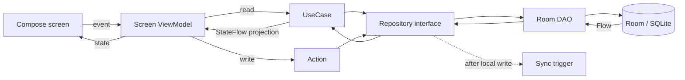
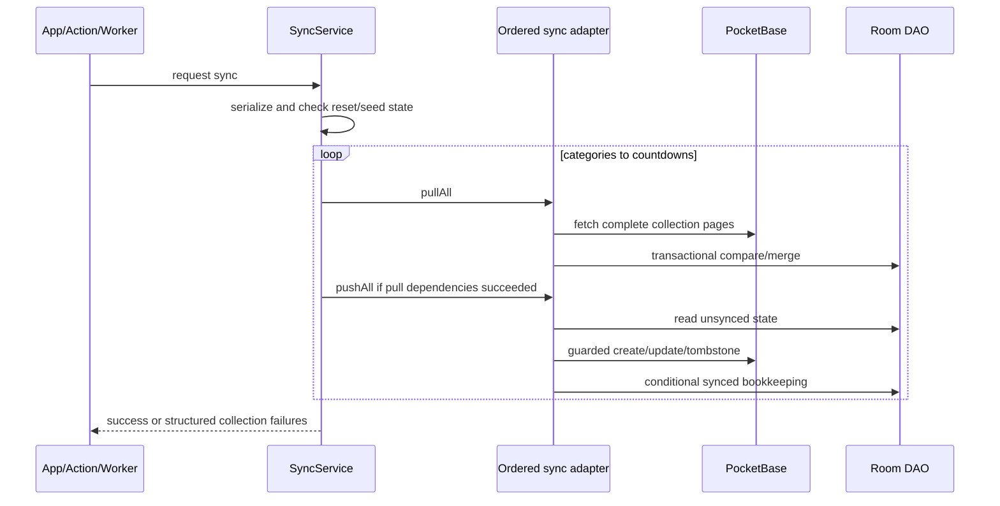

# OpenTasks Architecture Documentation

## 1. How to Read This Document

This document is the architecture reference for OpenTasks. It describes the current repository, not an aspirational redesign. Start with the overview and project structure, then use the subsystem sections when planning or reviewing a change. Source-level implementation rules remain in `docs/ai/`; feature behavior remains in `docs/features/`.

Paths are relative to the repository root. The most important boundary is the split between `composeApp`, which owns the shared Kotlin Multiplatform application, and the thin native application hosts in `androidApp` and `iosApp`.

## 2. Overview and Classification

OpenTasks is an offline-capable task-management application built around Eisenhower Matrix prioritization. It supports tasks, categories, tags, notes, countdowns, reminders, calendar views and import/export, attachments, optional authenticated PocketBase synchronization, deterministic Quick Add, and Android home-screen widgets.

- **Primary type:** cross-platform mobile application. Android and iOS host the shared Compose Multiplatform UI and domain/data layers.
- **Secondary type:** JVM desktop application. The same shared app is packaged for macOS, Windows, and Linux.
- **Platform extensions:** Android widgets, alarms, receivers, and WorkManager; iOS notification/background-task integration and a share extension.
- **Domain-specific concerns:** offline persistence, cross-device conflict handling, local/UTC time boundaries, recurring events, reminder identity, attachment lifecycle, and platform parity.

The application is local-first: normal UI reads and writes go through the local Room database. A fresh installation can adopt its cache into durable Local only mode without configuring PocketBase. PocketBase mode adds authenticated two-account synchronization, but Room remains the UI's direct source of truth in either mode.

## 3. Technology Stack

| Area | Current technology |
| --- | --- |
| Language | Kotlin 2.4.10; Swift 5 for the iOS host and share extension |
| Shared UI | Compose Multiplatform 1.11.0, Material 3 1.11.0-alpha07 |
| Navigation | AndroidX Navigation 3 runtime 1.1.4 with JetBrains Navigation 3 UI 1.1.1 |
| State and lifecycle | Coroutines/Flow 1.11.0, lifecycle ViewModels, per-screen `StateFlow` projections |
| Persistence | Room 2.8.4, KSP 2.3.9, SQLite Bundled driver 2.7.0 |
| Dependency injection | Koin BOM 4.2.1 |
| Date/time | `kotlinx-datetime` 0.8.0 |
| Synchronization | PocketBase Kotlin 2.7.4 over Ktor 3.4.2 |
| Android platform | AGP 9.2.1, API 26 minimum, API 36 compile/target, WorkManager 2.11.2, Glance 1.1.1 |
| Desktop | Compose Desktop with DMG, MSI, and DEB packaging |
| Tests | `kotlin.test`, JUnit 4.13.2, coroutines-test, Turbine, Ktor MockEngine, Kover 0.9.8 |
| Build | Gradle 9.4.1, Java/JVM target 17, version catalog |

Dependency versions are centralized in `gradle/libs.versions.toml`. Platform package versions are separate release surfaces; see Configuration and Versioning.

## 4. Project Structure

```text
OpenTasks/
├── androidApp/                    # Android application shell
│   └── src/main/
│       ├── AndroidManifest.xml
│       ├── kotlin/.../            # Activity, Application, receivers, worker, widgets
│       └── res/                   # Android and Glance resources
├── composeApp/                    # Shared KMP library and JVM desktop application
│   ├── schemas/                   # Exported Room schema history
│   └── src/
│       ├── commonMain/
│       │   ├── kotlin/.../
│       │   │   ├── data/          # Entities, DAOs, repositories, sync, platform contracts
│       │   │   ├── domain/        # Read UseCases and write Actions
│       │   │   ├── viewmodel/     # Screen state and event coordination
│       │   │   ├── navigation/    # Navigation 3 keys and back-stack wrapper
│       │   │   ├── ui/            # Compose screens, reusable UI, theme
│       │   │   └── di/            # Shared Koin registrations
│       │   └── composeResources/  # Shared strings, icons, and drawables
│       ├── androidMain/            # Android actual implementations
│       ├── iosMain/                # iOS actual implementations and UIKit bridge
│       ├── jvmMain/                # Desktop actual implementations and main entrypoint
│       ├── commonTest/             # Portable domain/data tests
│       └── jvmTest/                # JVM, Room, DI, UI-helper, and integration tests
├── iosApp/                         # SwiftUI/Xcode host and share extension
├── pocketbase/pb_migrations/       # PocketBase schema and sync-safety migrations
├── docs/                           # User, feature, AI, and TRIP documentation
├── gradle/libs.versions.toml        # Dependency and plugin versions
└── settings.gradle.kts             # Modules and dependency repositories
```

Generated files and build outputs live below module `build/` directories. Local generated sync defaults are created under `composeApp/build/generated/`; they are not source-controlled architecture inputs.

## 5. Core Architecture Principles

1. **Shared-first implementation.** Business logic, UI, state, persistence contracts, and sync live in `commonMain` whenever possible. Platform source sets contain only native integrations and `actual` implementations.
2. **Unidirectional layering.** UI sends events to ViewModels; ViewModels depend on domain UseCases and Actions; domain operations depend on repository interfaces; repositories wrap DAOs and platform services.
3. **Read/write separation.** Read operations are small UseCase classes, normally returning `Flow`. Mutations are Action classes with suspend entrypoints and own cross-cutting write behavior such as timestamps, reminders, or sync triggers.
4. **Room is the local source of truth.** Screens observe local flows. Optional remote synchronization updates Room through sync adapters rather than bypassing the local model.
5. **Explicit time boundaries.** UI/domain state uses local epoch milliseconds; persistence stores UTC epoch milliseconds. Repository and system-boundary code performs conversion.
6. **Durable deletion.** Normal synced deletes use soft-delete tombstones. Hard deletion is restricted to records that have never acquired remote identity, explicit local reset, or the confirmed owner-scoped local-authoritative replacement protocol.
7. **Project patterns over new abstractions.** Reuse established UseCases, Actions, ViewModels, platform contracts, resources, and Koin wiring before adding new layers.

## 6. Build System and Toolchain

The root project contains two Gradle modules:

- `composeApp` applies Kotlin Multiplatform, the AGP 9 KMP Android library plugin, Compose, serialization, KSP, Room, Kover, and desktop packaging plugins. It targets Android, `iosArm64`, `iosSimulatorArm64`, and JVM.
- `androidApp` is the Android application shell. It owns the stable application ID, version, manifest, Android components, and APK build types while depending on `composeApp`.

Required local tools are JDK 17 or newer, Android Studio/SDK for Android, and Xcode for iOS. The Gradle wrapper pins Gradle 9.4.1.

Common commands:

```bash
# Shared JVM compile and tests
./gradlew :composeApp:compileKotlinJvm
./gradlew :composeApp:jvmTest

# Android unit tests, lint, and APK
./gradlew :androidApp:testDebugUnitTest :androidApp:lintDebug :androidApp:assembleDebug

# Native compilation checks
./gradlew :composeApp:compileKotlinIosArm64 :composeApp:compileKotlinIosSimulatorArm64

# Desktop development and macOS release packaging
./gradlew :composeApp:run
./gradlew :composeApp:packageReleaseDmg
```

iOS application builds run through the `iosApp` Xcode scheme, which invokes Gradle to provide the static `ComposeApp` framework. Build and test tasks should be chosen according to the affected platform path; compilation alone does not verify widget, notification, share-extension, file-picker, or background-task behavior.

## 7. Configuration and Versioning

### Runtime configuration

PocketBase configuration is optional for Local only mode. When a user signs in or connects local data to PocketBase, the build-generated `LocalSyncDefaults.POCKETBASE_URL` supplies the initial endpoint from the first available value:

1. `opentasks.pocketbase.url` in the untracked root `local.properties` file;
2. Gradle property `opentasks.pocketbase.url`;
3. environment variable `OPENTASKS_POCKETBASE_URL`;
4. an empty default.

Signed-out users may choose Use without sync or enter a server URL and sign in. The endpoint is read-only while authenticated and may change only after logout. Detached authentication and capability validation occur before a normal client activation. Local-only connect uses a detached, count-only replacement preflight and does not change the active cache until explicit confirmation succeeds under the mutation gate.

The iOS host reads product identity and versions from `iosApp/Configuration/Config.xcconfig`; Xcode project and plist files declare notification, background refresh, URL handling, and share-extension capabilities. Android permissions and exported components are declared in `androidApp/src/main/AndroidManifest.xml`.

### Version surfaces

The project currently has multiple explicit version locations:

- Android: `androidApp/build.gradle.kts` uses `versionCode = 2` and `versionName = "1.1.0"`.
- iOS: `iosApp/Configuration/Config.xcconfig` uses `CURRENT_PROJECT_VERSION=2` and `MARKETING_VERSION=1.1.0`.
- Desktop packages: `composeApp/build.gradle.kts` uses `packageVersion = "1.1.0"`.

Release work must update and verify every platform surface in scope. Version 1.1.0 is the currently configured coordinated Android, iOS, and desktop release; the local-only, authoritative-connect, and Quick Add architecture documented here is present in development source but does not itself change those release surfaces.

## 8. UI, State, and Navigation

`composeApp/src/commonMain/.../App.kt` is the shared composition root. It installs `OpenTasksTheme` and restores account state before constructing task navigation or task-scoped ViewModels. Restoring, signed-out, transitioning, and reauthentication states render account-only UI. Valid `LocalOnly` and `Authenticated` states mount the same active-cache Navigation 3 subtree and epoch-keyed `ViewModelStore`; changing `CacheBinding.boundaryEpoch` clears the departing store so account-owned ViewModel state and coroutines cannot survive a local-to-remote conversion or account switch. Asynchronous foreground mutations capture their originating owner/epoch before dispatch and revalidate it after entering the shared mutation gate.

Navigation keys are serializable `Screen` types. `AppNavController` wraps back-stack mutation and tab-root replacement. Navigation 3 entry decorators retain saveable state and entry-scoped ViewModel stores. Matrix, Task List, Calendar, and Quadrant Detail task FABs open one shared creation chooser; Quick Add and the full editor receive the same category, priority, and optional Calendar civil-date context.

Screen ViewModels expose `StateFlow` values derived from UseCase flows. Expensive filtering, grouping, formatting maps, and calendar projections run outside composables, commonly on `Dispatchers.Default`, and use `SharingStarted.WhileSubscribed(5000)`. Composables render state and forward user intent; they do not call repositories or DAOs.

The shared Material 3 UI adapts across compact, medium, and expanded layouts. Shared Compose resources hold strings and drawables. Platform-specific previews are kept in `androidMain` because the IDE preview tooling is Android-based, even when the composable itself is shared. Network pull-to-refresh and sync-result presentation exist only in authenticated PocketBase mode; local-only screens render the underlying content without a no-op refresh wrapper.

## 9. Domain and Dependency Injection

The domain layer distinguishes:

- **UseCases:** focused reads and transformations such as observing tasks, categories, notes, countdowns, preferences, and attachment summaries, parsing bounded Quick Add input, or parsing/generating import/export formats.
- **Actions:** mutations and workflows such as task/category/note/countdown writes, reminder scheduling, sync configuration, imports, local reset, and attachment operations.

ViewModels inject UseCases and Actions, never repository implementations. Cross-record writes use explicit coordinators or Room writer transactions where atomicity matters.

`initKoin()` starts Koin with `sharedModule` plus a platform-specific `platformModule`. The shared module wires Room migrations, DAOs, repository interfaces, sync adapters, domain operations, and ViewModels. Platform modules supply the Room builder, attachment storage, calendar access, notification implementations, and other native services.

Each application host initializes Koin once:

- Android: `OpenTasksApplication`, with Android context.
- iOS: `MainViewController()` before composing the UIKit controller.
- Desktop: `main()` before opening the Compose window.

## 10. Persistence and Offline Data

Room database `opentasks.db` is currently schema version 12. Its entities are `Task`, `Category`, `Note`, `Tag`, `TaskTag`, `AppSettings`, `Countdown`, and `Attachment`. Exported schemas live under `composeApp/schemas/`, and explicit migrations cover each version from 1 through 12. Destructive migration fallback is not part of the design.

DAOs expose observable reads and suspend writes. Repository implementations:

- translate local timestamps to UTC before persistence and back to local values on reads;
- apply `distinctUntilChanged()` after conversion to suppress sync-only re-emissions;
- preserve tombstones and sync metadata;
- trigger debounced synchronization after normal writes;
- coordinate attachment files with their Room metadata.

User-visible queries normally exclude tombstones. Some reminder reconciliation and sync paths intentionally use tombstone-inclusive or raw-UTC DAO queries; these are documented boundary exceptions, not general shortcuts around repositories. Cache mode, binding, transition purpose/phase, and sync recovery mode are serialized in `app_settings`; local-only support and authoritative replacement do not require a Room schema change.

## 11. PocketBase Synchronization

PocketBase is the optional authenticated identity and synchronization service. Two pre-created `users` accounts are supported. Every synchronized record belongs to exactly one account through a required relation, server rules enforce owner-only access, and the structured client gateway independently rejects raw records whose owner differs from the active binding.

One installation has one active Room cache. A mode-specific `CacheBinding` proves either the reserved local owner plus boundary epoch, or a canonical PocketBase endpoint/server/account/capability tuple plus epoch. Both valid modes authorize task UI and local foreground/background work; only `POCKETBASE` authorizes provider activation and network synchronization. A local binding paired with a remote token, a PocketBase binding without its required token, or any transition marker fails closed. Connectivity-only refresh failures may use a proven remote cache offline; authentication rejection or missing/mismatched binding keeps task UI hidden. Retryable account-service responses (`408`, `425`, `429`, and `5xx`) are classified as connectivity failures so a temporary server or rate-limit condition does not erase valid offline-session authority.

Synchronization runs one collection at a time in dependency order:

1. categories
2. tags
3. tasks
4. attachments
5. task_tags
6. notes
7. countdowns

Each adapter pulls before it pushes. The single process-wide `AccountMutationGate` serializes user writes, active-cache callbacks, sync mutations, local clear, switch/logout, and cache replacement. `SyncService` also serializes passes with a mutex and prevents sync from racing reset/replacement. Parent pull failures suppress dependent pulls and pushes. Repository writes trigger sync only when PocketBase is active, while adapters use DAOs directly so remote merges do not recursively trigger new passes.

Conflict resolution is last-write-wins using app-managed UTC `updatedAt` and PocketBase `localUpdatedAt`:

- a strictly newer remote row may replace local state;
- a strictly newer unsynced local row may update remote state;
- equal timestamps are accepted only when canonical payloads match;
- durable deletes are synchronized as tombstones;
- active local rows missing after a trustworthy full remote fetch are marked unsynced for recreation.

Remote record updates use PocketBase's `PATCH` endpoint. If a locally stored PocketBase record ID is stale, guarded recovery resolves the record by owner-scoped `localId`, retries only when the local timestamp is newer, and updates local bookkeeping without weakening owner validation.

Account switching is restricted to the same canonical server/capability. It refreshes and fully synchronizes the source, requires zero unsynced rows, writes a durable transition, atomically replaces account-owned Room content and binding, activates the destination token, and performs an initial pull. Crash recovery treats the post-transaction destination binding as authoritative and never falls back to rendering the source cache. Logout uses the same source-sync safety gate.

Local clear and local-to-PocketBase connect use separate typed durable transitions. Local clear records `PRE_RESET` before the Room reset and `FILES_PENDING` before attachment cleanup, then converges to signed out. Connect is an explicitly destructive local-authoritative replacement: detached preflight requires capability version 2 plus `authoritativeReplaceVersion = 1` and exposes only sanitized counts/identity. Confirmation recomputes opaque complete local and destination-owner inventory fingerprints under the mutation gate. A mismatch returns a refreshed preview before any durable transition or remote mutation.

After confirmation, the durable destination binding and `REMOTE_DELETE_PENDING` marker are written before owner-scoped hard deletion. Records are deleted in reverse dependency order, the complete owner inventory must be empty, and one Room writer transaction resets all local PocketBase IDs/sync acknowledgements without deleting content or attachment files. `ServerSeedExecutor` then exact-seeds the preserved snapshot and verifies final active/tombstone inventory equality before token promotion and provider activation. Failure or process death resumes from the marker; a concurrent destination add/update/delete returns recovery to full delete/reset/reseed. Migration 012 grants hard delete only to the stored authenticated owner. Normal in-app deletion remains tombstone-based, and other owners never enter the inventory or delete requests.

Tokens use Android Keystore, iOS Keychain, and the macOS login keychain. Windows/Linux use an owner-only app-private fallback and surface a weaker-storage warning. Passwords are request-local and are never persisted. Protected attachment downloads use short-lived file tokens and retry once only after confirmed token rejection.

## 12. Date, Recurrence, and Reminder Architecture

The database stores UTC epoch milliseconds. UI, ViewModels, Actions, and most UseCases operate in local time. Repository conversions and explicitly documented scheduling/import boundaries prevent accidental double conversion.

`LocalDaySignal` provides a shared local-date stream for date-relative projections and refreshes on application resume. Task and countdown recurrence logic derives effective occurrences without mutating the stored recurrence anchor merely to render a future occurrence.

Quick Add uses a pure common parser with one screen-captured local `LocalDateTime`. It recognizes only the bounded, token-suffix English date/time/recurrence grammar documented in `docs/features/tasks.md` and performs civil-date arithmetic before converting the resolved value through `computeLocalMillis()`. The entry-scoped ViewModel owns recognition, removable-token suppression, duplicate-save protection, and active-cache boundary revalidation, then saves through `AddTaskAction`; no reminder is inferred.

Reminder identity includes the event, occurrence UTC instant, reminder kind, and stable ordinal. This identity flows through queue construction, platform scheduling, delivery, user actions, and cancellation.

- Android schedules alarms and persists semantic-key/request-ID mappings. Alarm, notification action/tap, widget, and WorkManager payloads carry account ID plus boundary epoch and fail closed before DAO access when stale.
- iOS rebuilds a unified task/countdown queue capped below the platform pending-notification limit and uses `UNUserNotificationCenter`. Notification/background callbacks restore and validate the current account boundary before work.
- Desktop currently provides no-op notification scheduling implementations; reminder UI and domain logic remain shared, but native desktop delivery is not implemented.

## 13. Native Platform Integration

### Android

`androidApp` owns `OpenTasksApplication`, `MainActivity`, notification receivers, `SyncWorker`, and three Glance widget families (task list, calendar, and week). The application pre-warms Room and refreshes widgets after process start. WorkManager requests periodic maintenance approximately every two hours; the worker validates either active cache mode, skips network sync in local-only mode, and still performs local reminder/widget maintenance.

The activity converts Android intents into shared events for notifications, widgets, shared text, and ICS payloads. FileProvider, calendar, notification, exact-alarm, boot, and widget components are declared in the manifest.

### iOS

The SwiftUI `iOSApp` hosts the shared Compose UI through `MainViewController`. `AppDelegate` integrates background refresh and user notifications. Kotlin supplies the shared sync/reminder work; Swift arbitrates background-task expiration and exactly-once completion.

The share extension accepts shared content and hands it to the containing app through the configured app group and custom URL path. Platform source code supplies iOS calendar, file, attachment, notification, and theme implementations.

### JVM Desktop

`composeApp/src/jvmMain/.../main.kt` opens one Compose Desktop window; there is no multi-process renderer or IPC layer. JVM actual implementations use native file dialogs/filesystem APIs where needed. The Room database and attachment storage live in per-user application data locations selected by the platform module.

Desktop packages target DMG, MSI, and DEB. Release ProGuard shrinking remains enabled while optimization is disabled; `proguard-desktop-release.pro` preserves generated, reflective, service-loaded, and JNI surfaces required at runtime.

## 14. Import, Export, and Attachments

Calendar-provider import is platform-backed. ICS and TickTick-style CSV parsing/generation are shared domain operations, while file selection and saving use `expect`/`actual` launchers. Android and iOS also accept shared content from native entrypoints.

Attachment metadata is stored in Room and synchronized through PocketBase. File bytes live in platform-managed storage. Operations coordinate database state and physical files so failed cleanup leaves recoverable metadata, and stale remote files cannot replace newer local edits or tombstones.

## 15. Data Flow Diagrams

### Normal screen read and write



### Optional synchronization pass



## 16. Error Handling and Observability

Expected validation failures are represented as explicit domain or sync exceptions and surfaced through ViewModel state or UI messages. Background and best-effort paths log failures without crashing the UI, while cancellation exceptions remain cancellation rather than being swallowed.

Sync aggregates pull/push failures by collection and fails the pass after safe independent work completes. Dependency-aware skip rules prevent children from pushing against failed parent state. Server configuration, reset, seed, and attachment operations fail closed when identity or data invariants cannot be proven.

Logging uses the multiplatform logging facade, with SLF4J/Logback on JVM and platform-appropriate backends elsewhere. Logs must not contain secrets or attachment contents. There is no remote analytics or crash-reporting subsystem in the current repository.

## 17. Testing Strategy

Tests are organized by source set:

- `commonTest`: portable parsers, including Quick Add grammar/civil-date precedence, date/time utilities, reminder identity/queue logic, sync record logic, domain transformations, and ViewModel-adjacent contracts.
- `jvmTest`: Room persistence and migrations, active-cache/account recovery, sync adapters, server replacement/seeding, DI resolution, Actions, ViewModels, and pure UI/navigation helpers.
- `androidApp/src/test`: Android worker and widget data-provider unit tests.

The shared JVM suite runs common and JVM tests through `./gradlew :composeApp:jvmTest`. Android shell tests run through `./gradlew :androidApp:testDebugUnitTest`. Kover can generate coverage reports and excludes generated code, DI wiring, platform shells, previews, resources, and UI packages; no minimum coverage threshold is configured.

Risk-based verification extends beyond unit tests:

- Room or sync changes require persistence/migration and sync-adapter tests.
- Cross-platform shared changes require relevant JVM, Android, and iOS compilation.
- Android app-shell changes require lint and APK assembly; widget/notification changes also need emulator or device checks.
- iOS host, notification, share-extension, or background-task changes require an Xcode build and relevant simulator/device behavior.
- Desktop release changes require packaging and launching the packaged artifact, not only `run` or compilation.

## 18. Performance Considerations

- Room `Flow` is observed through repositories; timestamp conversion is followed by `distinctUntilChanged()` to avoid sync bookkeeping recompositions.
- ViewModels precompute expensive maps, grouping, sorting, formatting, and calendar projections on `Dispatchers.Default` and expose subscription-aware `StateFlow` values.
- Navigation uses entry-scoped saveable state and ViewModel stores rather than global screen state.
- Sync is serialized and collection-scoped to preserve correctness and avoid concurrent remote/local races.
- Attachment bytes are processed outside Room transactions; only metadata and conditional install decisions use writer boundaries.
- Widget reads are specialized DAO-backed paths so Glance does not need to boot the full UI state graph.

There are no formal startup, frame-time, database-size, or sync-duration budgets in the repository. Performance changes should be measured on the affected platform and data scale.

## 19. Security and Privacy Considerations

OpenTasks stores task content and settings locally in an unencrypted Room/SQLite database and platform file storage. Platform backup behavior follows the host configuration; Android currently permits application backup.

PocketBase mode supports exactly two pre-created users in this deployment model. The
client authenticates each user through PocketBase's `users` collection, and every
synchronized record has a required owner relation. Collection rules require an
authenticated request and restrict reads and writes to the stored owner; creates
and updates must carry the active owner's relation. The client-side structured
gateway independently injects the active owner and rejects raw responses whose
owner does not match the active cache binding.

Attachment file access is protected by PocketBase file tokens rather than public
attachment URLs. Tokens are stored in Android Keystore, iOS Keychain, and the
macOS login keychain; Windows/Linux use the documented owner-only app-private
fallback and surface a weaker-storage warning. Passwords and file tokens are not
persisted in application settings or logged.

Local-only mode stores no PocketBase credentials and performs no server requests. The local Room/SQLite database and platform attachment files remain unencrypted,
and platform backup behavior follows the host configuration. PocketBase
transport security depends on the configured endpoint, so deployments still
require HTTPS, appropriate reverse-proxy/access-control hardening, and reliable
database and attachment-storage backups. This is an explicitly bounded
two-account deployment model, not arbitrary multi-tenant registration or shared
task hosting.

Native entrypoints must validate external intents, URLs, files, and shared payloads. Exported Android components and iOS extension/app-group capabilities should remain as narrow as their workflows permit.

## 20. Packaging and Distribution

- **Android:** `:androidApp:assembleDebug` builds the development APK. The current release build is minification-disabled and uses the debug signing configuration; production signing/distribution is not configured.
- **iOS:** build the `iosApp` scheme in Xcode. Team ID, signing, provisioning, and store distribution are environment/project configuration concerns.
- **Desktop:** Compose native distributions produce DMG, MSI, and DEB artifacts. The documented macOS task is `:composeApp:packageReleaseDmg`; signing and notarization are not configured.
- **PocketBase:** JavaScript migrations in `pocketbase/pb_migrations/` create and harden the server collections. The server is deployed separately from the clients and its SQLite data requires independent backups.

Application releases must preserve the stable identifiers and data locations used by Room, notifications, WorkManager, widgets, app groups, and desktop packages.

## 21. Known Constraints and Maintenance Boundaries

- Device clock skew can choose the wrong winner in last-write-wins synchronization.
- Desktop native reminder delivery is not implemented.
- PocketBase mode supports two pre-created accounts; it has no public
  signup, invitations, password reset, or account administration flow.
- Local only mode is single-installation storage, not a backup or multi-device merge. Connecting it to PocketBase replaces the authenticated destination owner's complete synchronized data after explicit confirmation.
- Local Room/SQLite content and platform attachment files are unencrypted; HTTPS,
  deployment/access-control hardening, and backup/restore rehearsal remain
  operator responsibilities.
- Platform version values are not driven from one shared source.
- Production Android signing and macOS signing/notarization are not configured.
- Full platform behavior cannot be proven by a single Gradle compile or test task.

Changes that alter layering, module ownership, persistence/sync contracts, platform entrypoints, build targets, or verification requirements must update this document and the relevant `docs/ai/*` guidance.

## 22. Conclusion

OpenTasks is a shared-first Kotlin Multiplatform application with thin native hosts, a layered UseCase/Action architecture, Room as the local source of truth, durable local-only operation, and optional guarded PocketBase synchronization. Its most important invariants are the `androidApp`/`composeApp` ownership split, ViewModel-to-domain dependency direction, mode-specific active-cache boundaries, one process-wide mutation gate, explicit local/UTC boundaries, durable tombstones outside confirmed owner replacement, dependency-ordered sync/seed recovery, and platform-specific verification for native behavior.
